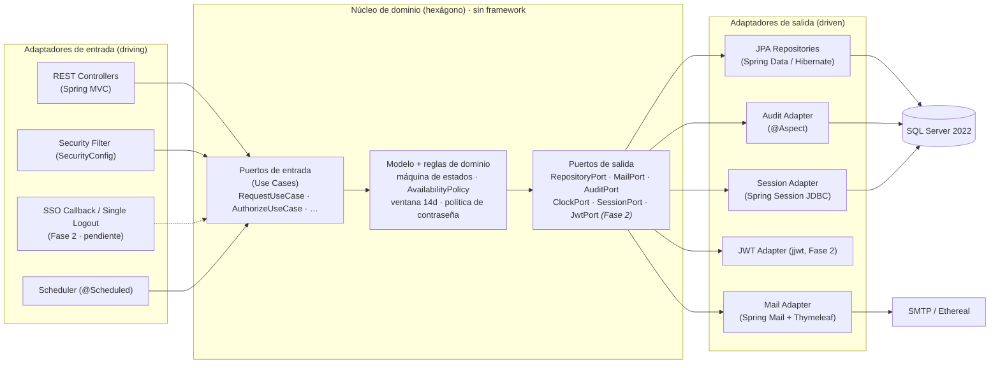
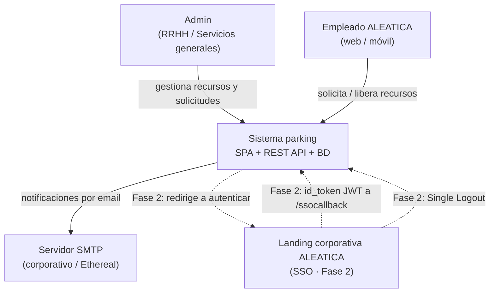
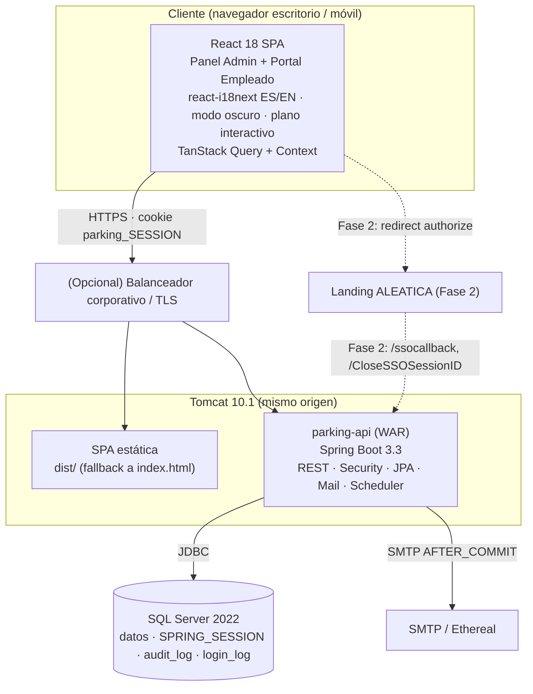
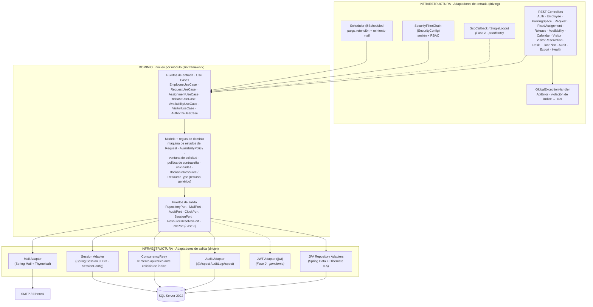
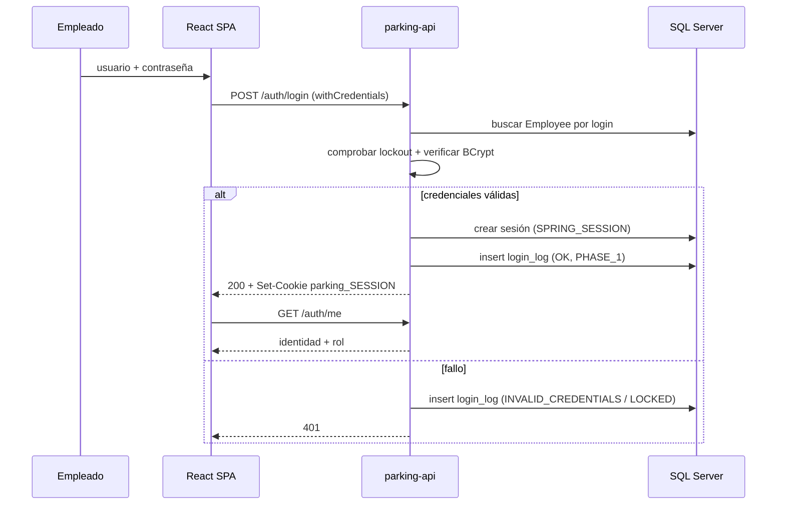
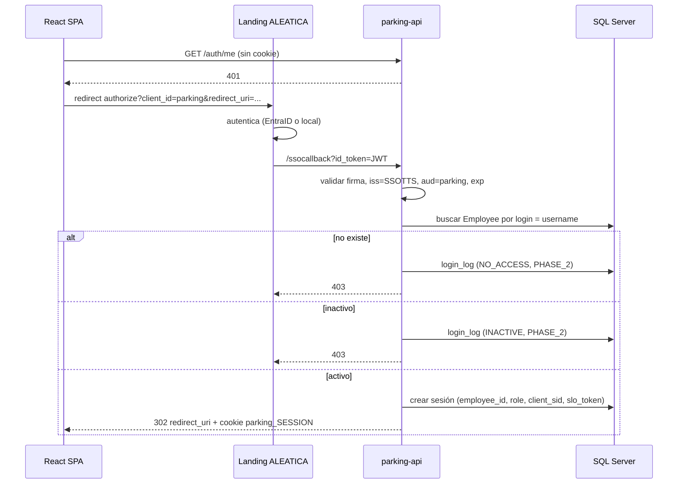
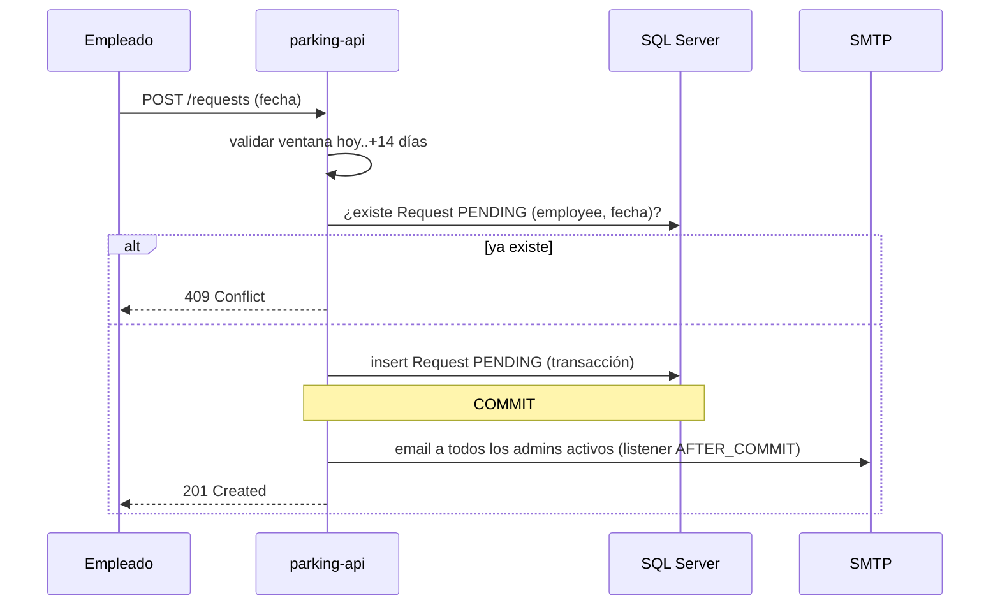
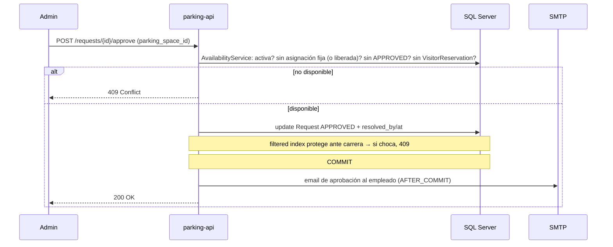
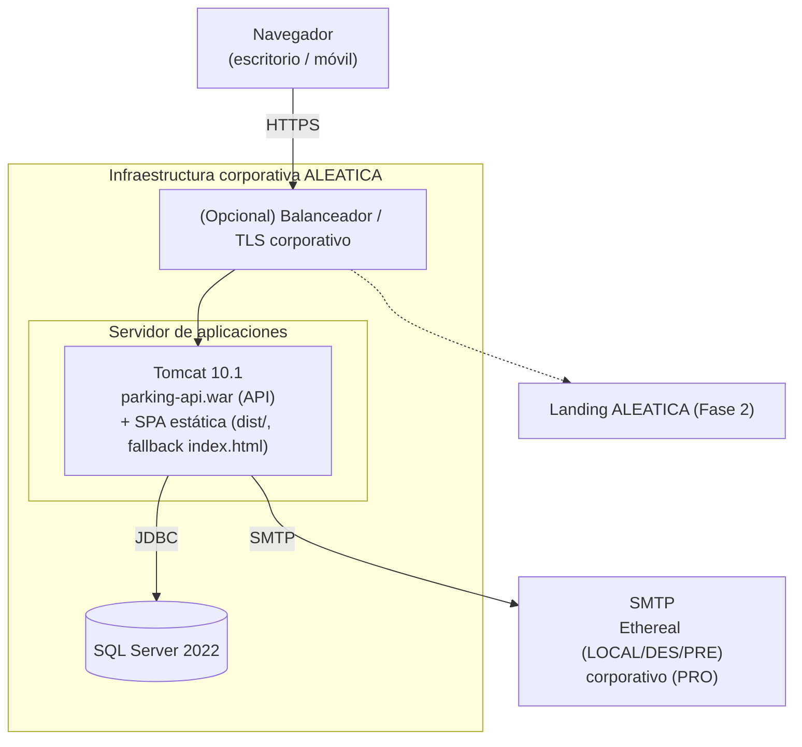

# architecture.md — Arquitectura de alto nivel

> **Producto:** parking — gestión de plazas de parking y puestos de oficina de ALEATICA.
> **Audiencia:** equipo técnico (backend, frontend, DevOps), `database-optimizer`, `security-auditor`.
> **Fuentes usadas (exclusivamente):** `README.md` (especificación funcional), `docs/PROJECT.md` (PRD y stack), `docs/data-model.md` (modelo de datos), `docs/mockups/` y `docs/assets/plano-verificacion.png`.
> **Convención de nombres:** prosa en español; identificadores de código (módulos, clases, enums) en inglés, según la *Nomenclatura del código* del README.
> **Principio:** este documento no inventa decisiones no respaldadas por las fuentes. Lo que no consta se marca como `_[pendiente]_` (sección 16).

---

## Tabla de contenidos

1. Propósito y alcance
2. Drivers arquitectónicos
3. Estilo arquitectónico (monolito modular + hexagonal por módulo)
4. Vista de contexto (C4 nivel 1)
5. Vista de contenedores (C4 nivel 2)
6. Vista de componentes del backend (C4 nivel 3) — separación dominio/infraestructura
7. Vista de módulos (monolito modular)
8. Flujos clave (diagramas de secuencia)
9. Vista de despliegue
10. Arquitectura del frontend
11. Seguridad
12. Datos y persistencia
13. Aspectos transversales (cross-cutting)
14. Decisiones de arquitectura (ADR resumidos)
15. Stack tecnológico: ventajas, desventajas y alternativa
16. Riesgos y pendientes

---

## 1. Propósito y alcance

parking es una aplicación web corporativa que gestiona **recursos reservables** (plazas de parking y puestos de oficina) mediante asignación fija por día de la semana, solicitud puntual con aprobación, liberación y reservas de visitante. Sirve a dos perfiles —`ADMIN` y `EMPLOYEE`— desde web de escritorio y móvil.

El alcance de este documento es el **diseño de alto nivel**: estilo arquitectónico, contenedores, módulos, flujos críticos y despliegue. El detalle de datos vive en `docs/data-model.md` y el detalle funcional en el `README.md`. Cubre las dos fases de autenticación —**Fase 1 login local (implementada)** y **Fase 2 SSO ALEATICA (diseño pendiente, aún no implementado)**— y el alcance ampliado de puestos/plano.

---

## 2. Drivers arquitectónicos

Requisitos —extraídos de las fuentes— que moldean la arquitectura:

| Driver | Origen | Implicación arquitectónica |
|--------|--------|----------------------------|
| RBAC de dos roles (`ADMIN`/`EMPLOYEE`) | README | Cadena de filtros de seguridad + autorización por endpoint. |
| Sesión server-side con cookie (`parking_SESSION`) | README | Spring Session JDBC sobre SQL Server; no JWT de sesión propia. |
| Dos fases de autenticación, conmutables | README | Autenticación desacoplada del resto vía un módulo `auth` con dos estrategias. |
| Single Logout desde la landing (Fase 2) | README | Sesión en BD localizable por `client_sid` para invalidación remota. |
| Concurrencia en aprobación de plaza | README, data-model | Unicidad garantizada por *filtered indexes* en BD (no locking aplicativo). |
| Cálculo de disponibilidad multi-condición | README | Servicio de dominio `AvailabilityService` con índices de soporte. |
| Auditoría completa y separada de logins | README, data-model | Auditoría transversal por AOP (`audit_log`) + `login_log` en el filtro de auth. |
| Email transaccional fiable (`AFTER_COMMIT`) | README | Publicación de eventos de dominio + listener `AFTER_COMMIT` + reintento programado. |
| Retención 2 años con purga por lotes | README, data-model | Job `@Scheduled` con `DELETE TOP (1000)`. |
| i18n ES/EN + modo oscuro + mobile-first | README, mockups | SPA con capa de internacionalización y diseño responsive. |
| Plano interactivo con coordenadas relativas | README, mockups, assets | Componente de frontend sobre imagen de planta + editor de arrastre; coords `%` en BD. |
| Empaquetado WAR sobre Tomcat 10.1 corporativo | PROJECT.md, data-model | Backend desplegable como WAR; frontend estático servido por proxy. |
| Exportación CSV/XLSX | README, mockups | Servicios de exportación bajo demanda. |

---

## 3. Estilo arquitectónico (monolito modular + hexagonal por módulo)

### 3.1 Visión macro: monolito modular + SPA

**Monolito modular** (backend) + **SPA** (frontend), comunicados por **REST sobre HTTPS** con sesión por cookie.

- **Por qué monolito modular y no microservicios:** el dominio es cohesionado, el volumen es modesto (estimación PROJECT.md: < 500 empleados) y el roadmap se expresa en módulos funcionales con dependencias claras. Un monolito modular da transacciones simples (clave para disponibilidad/concurrencia), despliegue único (un WAR) y menor coste operativo, sin renunciar a límites internos por módulo que permitirían extraer servicios en el futuro si hiciera falta.
- **Frontend desacoplado:** React 18 SPA que consume la API con `withCredentials`. Servido como estático **por el propio Tomcat (mismo origen)**, con fallback SPA a `index.html`.

### 3.2 Visión por módulo: arquitectura hexagonal (Puertos y Adaptadores)

Dentro del monolito, **cada módulo funcional** (`employees`, `requests`, `availability`, `releases`, `auth`, …) se organiza según **arquitectura hexagonal (puertos y adaptadores)**. El objetivo es **aislar el núcleo de dominio** —reglas de negocio puras— de la **infraestructura** (Spring, Hibernate, SQL Server, SMTP, JWT), de modo que la lógica sea testeable sin contenedor ni base de datos y la tecnología sea reemplazable sin tocar el dominio.

Cada hexágono se compone de:

- **Núcleo de dominio**: modelo de dominio y reglas (máquina de estados de `Request`, política de disponibilidad, ventana de solicitud de 14 días, política de contraseña, unicidades). **No depende de ningún framework.**
- **Puertos de entrada (driving / inbound)**: interfaces de caso de uso que el dominio expone (p. ej. `RequestUseCase` con `createRequest` / `approve` / `reject` / `cancel`). Son el único punto de entrada a la lógica.
- **Puertos de salida (driven / outbound)**: interfaces que el dominio necesita del exterior (p. ej. `RequestRepositoryPort`, `MailPort`, `AuditPort`, `ClockPort`, `JwtPort`, `SessionPort`). El dominio depende de la abstracción, nunca de la implementación.
- **Adaptadores de entrada**: REST controllers, el callback SSO, el filtro de seguridad y el scheduler; traducen el mundo externo a llamadas a los puertos de entrada.
- **Adaptadores de salida**: las implementaciones Spring Data/Hibernate de los repositorios, el adaptador de correo (Thymeleaf + SMTP), el de auditoría (AOP), el de validación JWT (Fase 2) y el de sesión (Spring Session JDBC). Implementan los puertos de salida.

**Regla de dependencias:** todo apunta hacia el dominio. Los adaptadores conocen los puertos; el dominio no conoce a los adaptadores (inversión de dependencias). Frente al esquema clásico de capas (controller → service → repository), aquí el `service` pasa a ser el **núcleo de dominio** detrás de puertos, y el `repository` concreto es **un adaptador más**, intercambiable.

**Beneficios concretos en Parking:**
- **Reglas críticas testeables en aislamiento:** disponibilidad, máquina de estados de la solicitud y ventana de 14 días se prueban sin SQL Server.
- **Doble autenticación como dos adaptadores de entrada** (login local Fase 1 y SSO Fase 2) sobre el mismo `AuthorizeUseCase`: cambiar de fase no toca el dominio.
- **Persistencia reemplazable:** SQL Server ↔ PostgreSQL detrás del `RepositoryPort` sin impacto en negocio.
- **Efectos colaterales desacoplados:** email y auditoría son adaptadores de salida; el dominio solo emite la intención, no conoce SMTP ni AOP.
- **Tiempo como puerto (`ClockPort`):** la ventana de solicitud y la rotación de 90 días se testean con reloj fijo.

> **Nota pragmática:** en el arranque, el modelo de dominio y la entidad JPA pueden coincidir para evitar boilerplate; si la divergencia entre ambos crece, el mapeo dominio↔entidad se localiza en el adaptador de persistencia, sin filtrar JPA al dominio.

### 3.3 Diagrama de Puertos y Adaptadores

### 3.4 Puertos y adaptadores en Parking (mapeo)

| Elemento hexagonal | Tipo | Ejemplos en Parking |
|--------------------|------|---------------------|
| Adaptador de entrada | driving | REST Controllers, `SecurityFilterChain` (`SecurityConfig`), `Scheduler`; `SsoCallback` / `SingleLogout` _(Fase 2 · pendiente)_ |
| Puerto de entrada | use case | `EmployeeUseCase`, `RequestUseCase`, `AssignmentUseCase`, `ReleaseUseCase`, `AvailabilityUseCase`, `VisitorUseCase`, `AuthorizeUseCase` |
| Núcleo de dominio | dominio | `Request` + `RequestStatus` (máquina de estados), `AvailabilityPolicy`, reglas de `FixedAssignment`, política de contraseña, unicidades |
| Puerto de salida | driven | `*RepositoryPort`, `MailPort`, `AuditPort`, `ClockPort`, `JwtPort`, `SessionPort` |
| Adaptador de salida | driven | Spring Data JPA repos, `MailService` (Thymeleaf), `AuditLogAspect`, validador `jjwt`, Spring Session JDBC |

---

## 4. Vista de contexto (C4 nivel 1)

El visitante **no** es un actor: no accede al sistema; existe solo como dato de una reserva creada por el admin.

---

## 5. Vista de contenedores (C4 nivel 2)

> **Despliegue sin reverse proxy dedicado:** el propio **Tomcat 10.1 sirve la SPA estática y la API** en el **mismo origen** (`parking.aleatica.com`). No se usa Nginx/IIS por separado. La terminación TLS la hace Tomcat o un balanceador corporativo si existe (opcional). Al ser mismo origen, **CORS no es necesario en producción** (solo en desarrollo, con la SPA en `:5173`).

---

## 6. Vista de componentes del backend (C4 nivel 3) — separación dominio/infraestructura

Esta vista refleja la arquitectura hexagonal de la sección 3: una franja de **infraestructura de entrada** (adaptadores driving), el **núcleo de dominio** (puertos de entrada → reglas → puertos de salida, sin dependencias de framework) y una franja de **infraestructura de salida** (adaptadores driven). El dominio queda en el centro y no conoce a ningún adaptador.

> **Módulos de infraestructura transversal** (no mostrados como puertos porque son plomería, no dominio): `config/` (`SecurityConfig`, `SessionConfig`, `OpenApiConfig`), `exception/` (`GlobalExceptionHandler` + `ApiError`: traduce la violación de índice único a `409 Conflict`), `concurrency/` (`ConcurrencyRetry`: reintento aplicativo acotado cuando SQL Server elige la inserción concurrente como víctima de deadlock), `health/` (`HealthController`, `GET /api/v1/health`) y `resource/` (`BookableResource` / `ResourceResolverPort` / `ResourceType`, núcleo del `generic-resource-refactor` que unifica plazas y puestos).

> **Cómo leerlo:** los adaptadores de entrada solo invocan **puertos de entrada**; el dominio solo invoca **puertos de salida** (interfaces), cuyas implementaciones son los adaptadores de salida. Ningún `Controller` contiene lógica de negocio y ningún componente de dominio importa Spring/Hibernate. `AvailabilityUseCase` es reutilizado por `RequestUseCase` (al crear/aprobar), por el `AvailabilityController` (disponibilidad y vista del plano) y por el `CalendarController` (vistas de calendario `/calendar/admin` y `/my-week`). Las notificaciones por email no son una llamada directa: el dominio emite la intención y el `Mail Adapter` la materializa `AFTER_COMMIT`.

---

## 7. Vista de módulos (monolito modular)

Los módulos del backend siguen el **roadmap funcional** del README (con nombres de paquete Java reales bajo `com.aleatica.parking`), lo que mantiene la trazabilidad entre arquitectura, specs y entrega. La columna «Paquete» refleja el nombre real en el código; el roadmap del README usa etiquetas funcionales que no siempre coinciden 1:1:

| Paquete (real) | Responsabilidad | Entidades principales |
|----------------|-----------------|-----------------------|
| `auth` | Login local (Fase 1: `login`/`logout`/`me`/`change-password`), sesión, lockout, política de contraseña. SSO callback + SLO **(Fase 2 · pendiente, no implementado)** | `Employee` (credenciales), `login_log` |
| `employee` | CRUD de empleados, RBAC, reset de contraseña | `Employee` |
| `parkingspace` | CRUD de plazas | `ParkingSpace` |
| `fixedassignment` | Asignación fija por día de semana, revocación lógica | `FixedAssignment` |
| `request` | Solicitud puntual, aprobación/rechazo, cancelación | `Request` |
| `release` | Liberación voluntaria y administrativa | `Release` |
| `availability` | Cálculo de disponibilidad (`AvailabilityController`) y vistas de calendario (`CalendarController`: `/calendar/admin`, `/my-week`) | (consulta todas) |
| `visitor` | Fichas de visitante (`VisitorController`) y reservas de plaza (`VisitorReservationController`) | `Visitor`, `VisitorReservation` |
| `desk` | Puestos, categorías, coordenadas (alcance ampliado) | `Desk` |
| `floorplan` | Plano interactivo y editor de coordenadas (paquete distinto de `desk`) | (coords sobre `Desk`) |
| `notification` | Emails transaccionales por evento | (plantillas / outbox) |
| `audit` | Auditoría transversal y consulta (`/audit`, `/login-logs`) | `AuditLog`, `login_log` |
| `export` | Exportación CSV/XLSX | (histórico) |
| `resource` | Núcleo del `generic-resource-refactor`: `BookableResource`, `ResourceResolverPort`, `ResourceType` (abstrae plaza/puesto) | `BookableResource` |
| `concurrency` | `ConcurrencyRetry`: reintento aplicativo acotado ante colisión de índice único filtrado (víctima de deadlock) | — |
| `exception` | `GlobalExceptionHandler` + `ApiError`: traducción de violación de índice a `409` y respuesta de error homogénea | — |
| `config` | `SecurityConfig`, `SessionConfig`, `OpenApiConfig` (plomería de framework) | — |
| `health` | `HealthController`, `GET /api/v1/health` | — |

Cada módulo funcional es un **hexágono** (sección 3.2): expone su lógica por puertos de entrada y declara sus dependencias como puertos de salida. Las dependencias entre módulos de la tabla se resuelven puerto-a-puerto (p. ej. `request` consume el puerto de entrada de `availability`, no su implementación). Los paquetes `concurrency`, `exception`, `config`, `health` y (en parte) `resource` son **infraestructura transversal**, no hexágonos funcionales.

El alcance ampliado introduce primero un `generic-resource-refactor` que generaliza `ParkingSpace`/`Desk` bajo `BookableResource` (`resource_id`) antes de añadir `desks` y `floor-plan` (ver roadmap del README).

---

## 8. Flujos clave (diagramas de secuencia)

### 8.1 Login local (Fase 1)

### 8.2 SSO ALEATICA (Fase 2 · pendiente) — `/ssocallback`

> ⚠️ **No implementado.** Este flujo describe el diseño previsto de la Fase 2 (ver `openspec/changes/init-auth-sso/`). Nada de lo aquí descrito —`/ssocallback`, `id_token`, `client_sid`, `slo_token`, `JwtPort`, Single Logout— existe todavía en el código: `AuthController` solo expone `login` / `logout` / `me` / `change-password` (Fase 1). Se conserva como referencia de la fase futura.

### 8.3 Crear solicitud + email `AFTER_COMMIT`

### 8.4 Aprobar solicitud — disponibilidad y concurrencia

> La **concurrencia** (dos admins aprobando la misma plaza/fecha a la vez) se resuelve en la BD: el conjunto de *filtered indexes* (p. ej. `UX_requests_space_date_approved`) y la validación de disponibilidad dentro de la transacción convierten la colisión en un `409 Conflict` determinista, **sin bloqueo pesimista aplicativo**. Para el caso en que SQL Server resuelve la carrera eligiendo una inserción como víctima de deadlock (1205), el adaptador web aplica un **reintento acotado** (`concurrency/ConcurrencyRetry`) fuera de la transacción, que tras el commit del ganador produce el mismo `409` en vez de un `500`.

---

## 9. Vista de despliegue

- **Sin reverse proxy dedicado:** Tomcat 10.1 sirve **API + SPA en el mismo origen**. La SPA se sirve como recursos estáticos con fallback a `index.html`; la API bajo `/parking-api/api/v1`. Un balanceador/TLS corporativo por delante es opcional.
- **Entornos:** DES, PRE, PRO (PROJECT.md), cada uno con su perfil de configuración (`parking.*`). El correo usa **Ethereal en LOCAL/DES/PRE** y **SMTP corporativo solo en PRO**. Las credenciales se inyectan por variables de entorno (`SMTP_*`), nunca versionadas.
- **Backend y frontend** corren on-premise; no hay cloud público externo (restricción PROJECT.md).

---

## 10. Arquitectura del frontend

Evidencia tomada de los mockups (`docs/mockups/`) y del README:

- **SPA React 18** con dos áreas: **Panel de Administración** (layout header + sidebar + contenido + modales) y **Portal del Empleado** (responsive, vista de móvil con tarjetas "Mi Semana" y flujo de solicitud).
- **Identidad visual corporativa QRIA** (observada en los mockups): curva decorativa verde/naranja en el header, sidebar blanca, tablas con cabecera gris oscura, modales con cabecera verde (aprobar) / roja (rechazar), e **iconografía Tabler Icons**.
- **Sistema de estados por color** (calendario y plano): asignada, liberada, pendiente, solicitud aprobada, libre — coherente entre escritorio y móvil.
- **Sidebar de navegación** (de `shell.js`): Asignación semanal, Solicitudes (con badge de pendientes), Empleados, Plazas, Administración.
- **Diseño**: ✅ **design system propio** (CSS propio con variables + Tabler Icons sobre la identidad QRIA, **sin** librería de componentes tipo MUI), fiel a los mockups.
- **Decisiones de stack frontend** (fijadas): build/test **Vite + Vitest** (+ RTL), E2E **Playwright**, i18n **react-i18next** (ES/EN), estado **TanStack Query** (estado de servidor) **+ React Context** (auth/tema/idioma).
- **Plano interactivo**: imagen de planta (`docs/assets/plano-verificacion.png`) como fondo, con marcadores posicionados por coordenadas relativas (`%`), coloreados por estado; el editor de admin reposiciona marcadores por arrastre y persiste coordenadas.

### 10.1 Estrategia responsive (web móvil)

| Área | Objetivo de dispositivo | Comportamiento |
|------|--------------------------|----------------|
| **Portal del Empleado** | **Móvil + escritorio** (mobile-first) | Vistas pensadas para móvil: "Mi Semana", solicitud, liberación, plano (pinch-zoom + lista de libres). Es la superficie principal en teléfono. |
| **Panel de Administración** | **Escritorio** (uso responsive básico en móvil) | Diseñado para pantalla amplia (sidebar + tablas multi-columna). En móvil **degrada**, no se rediseña: ver reglas abajo. |

**Reglas responsive** (implementadas en `docs/mockups/styles.css`, breakpoint `≤ 768px`; el frontend React las reproducirá):
- **Viewport**: todas las páginas declaran `<meta name="viewport" content="width=device-width,initial-scale=1">` (presente en los 25 mockups).
- **Layout**: `flex-direction: column`; la **sidebar colapsa** a una barra superior con scroll horizontal.
- **Tablas anchas** (calendario, empleados, auditoría): **scroll horizontal** dentro de su contenedor (`min-width` + `overflow-x:auto`), en vez de desbordar la pantalla. *(Mejora futura opcional: en móvil convertir filas en tarjetas.)*
- **Formularios y modales**: a **una columna** y **ancho completo**.
- **Header**: se oculta el título de página; la curva decorativa se reduce.

> ⚠️ **Pendiente de implementación**: estas reglas son la **estrategia** y su demostración en los mockups; la responsividad real (breakpoints afinados, sidebar/menú móvil del admin, tablas→tarjetas) se materializa al construir el frontend React. Los mockups demuestran el móvil del empleado con marcos de teléfono (`.phone`), no como páginas fluidas.

---

## 11. Seguridad

- **Autenticación (Fase 1 · implementado):** login local con BCrypt (coste 12), bloqueo tras 5 intentos/15 min, política de contraseña y cambio obligatorio tras reset. `AuthController` expone `login` / `logout` / `me` / `change-password`.
- **Autenticación (Fase 2 · pendiente, no implementado):** delegaría la autenticación en la landing ALEATICA y solo **autorizaría** validando el JWT (`/ssocallback`) y consultando `employees`. Aún no existe en el código.
- **Sesión:** server-side vía **Spring Session JDBC** sobre SQL Server; cookie `parking_SESSION` con `HttpOnly`, `Secure`, `SameSite=Lax`. El **Single Logout** localizando la sesión por `client_sid` es diseño de **Fase 2 (pendiente)**; en Fase 1 el logout invalida la sesión local.
- **Autorización:** RBAC `ADMIN`/`EMPLOYEE` en la cadena de filtros (`SecurityConfig`); el rol procede **siempre** de `Employee.role`, nunca del claim `roles` del JWT.
- **Validación JWT (Fase 2 · pendiente):** firma + `iss`/`aud`/`exp`. La clave de firma la provee ALEATICA (bloqueante externo). No implementado.
- **CORS:** en **producción no es necesario** (SPA y API en el mismo origen, servidas por Tomcat). Solo aplica en **desarrollo** (SPA en `:5173`), con orígenes permitidos por configuración (`parking.cors.*`) y `withCredentials`.
- **Trazabilidad:** todo intento de login en `login_log`; toda acción funcional sensible en `audit_log`.
- **RGPD:** retención 2 años de históricos y derechos gestionados vía admin (PROJECT.md).

---

## 12. Datos y persistencia

- **ORM:** Spring Data JPA + Hibernate 6.5; `ddl-auto=validate` (el esquema lo gobierna Flyway, ver `data-model.md`).
- **Migraciones:** Flyway 10, una tabla por migración (ruta `db/migration/`):

  | Versión | Contenido |
  |---------|-----------|
  | `V1` | Esquema de **Spring Session** (`SPRING_SESSION` / `SPRING_SESSION_ATTRIBUTES`) |
  | `V2` | `audit_log` + `login_log` |
  | `V3` | Índices de infraestructura |
  | `V4` | `employees` |
  | `V6` | `parking_spaces` |
  | `V7` | `fixed_assignments` |
  | `V8` | `requests` (+ *filtered indexes* `UX_requests_employee_date_pending`, `UX_requests_space_date_approved`) |
  | `V9` | `releases` |
  | `V10` | `visitors` / `visitor_reservations` |
  | `V11` | `email_outbox` |
  | `V12` | `generic_resource_refactor` (`BookableResource`) |
  | `V13` | `desks` |
  | `V15` | Índice filtrado de puestos en el plano |

  El **admin** no es una migración de esquema: es un **seed de desarrollo** (`db/seed/dev/V5__seed_dev_admin.sql`), aplicado solo en entornos de desarrollo, no en PRO.
- **Integridad y concurrencia:** *filtered unique indexes* para unicidades parciales (asignación activa por día, una solicitud `PENDING` por empleado/fecha, `login`/`email`/`national_id` únicos).
- **Revocación lógica:** nunca se borran filas vivas; se marcan `active = false`.
- **Retención:** job `@Scheduled` diario con `DELETE TOP (1000)` en bucle para `audit_log`, `login_log`, `requests` cerradas, `releases`, `visitor_reservations` con antigüedad > 2 años.
- **Sesiones:** tablas oficiales `SPRING_SESSION` / `SPRING_SESSION_ATTRIBUTES`.

---

## 13. Aspectos transversales (cross-cutting)

| Concern | Mecanismo |
|---------|-----------|
| Auditoría | Adaptador de salida `@Aspect` sobre los casos de uso anotados → `audit_log`. |
| Logins | Registro en el filtro de autenticación → `login_log`. |
| Email | Eventos de dominio + listener **`AFTER_COMMIT`**; fallo SMTP no revierte la operación; reintento por job programado. |
| Programación | `@Scheduled` para purga de retención y reintento de correo. |
| i18n | Capa de internacionalización ES/EN en el frontend; plantillas de email por idioma. |
| Manejo de errores | Respuestas semánticas (`401`, `403`, `409 Conflict` en colisiones/unicidad). |
| Exportación | Servicios CSV/XLSX bajo demanda. |
| Documentación API | SpringDoc OpenAPI / Swagger UI (stack PROJECT.md / data-model). |

---

## 14. Decisiones de arquitectura (ADR resumidos)

| # | Decisión | Alternativa descartada | Motivo |
|---|----------|------------------------|--------|
| ADR-01 | Monolito modular | Microservicios | Dominio cohesionado, escala < 500 usuarios, transacciones simples para disponibilidad. |
| ADR-08 | Arquitectura hexagonal (puertos y adaptadores) por módulo | Capas tradicionales controller→service→repository | Aísla el dominio de la infraestructura: reglas testeables sin BD, doble auth (Fase 1/2) como adaptadores sobre un mismo use case, persistencia reemplazable. |
| ADR-02 | Sesión server-side por cookie (Spring Session JDBC) | JWT de sesión stateless | Necesidad de invalidación remota (Single Logout Fase 2) y revocación inmediata. |
| ADR-03 | SPA React desacoplada | Renderizado servidor (Thymeleaf) | Plano interactivo, móvil y modales ricos vistos en mockups. |
| ADR-04 | Unicidad/concurrencia por *filtered index* en BD + **reintento aplicativo acotado** (`concurrency/ConcurrencyRetry`) | Bloqueo pesimista aplicativo (`SELECT ... FOR UPDATE`) | El índice único filtrado (p. ej. `UX_requests_space_date_approved`, V8) garantiza la unicidad y convierte la colisión en `409` determinista. No se usa bloqueo pesimista; sí un reintento acotado fuera de transacción para el caso en que SQL Server elija una inserción concurrente como víctima de deadlock (1205), traduciéndola también a `409` en vez de a un `500`. Más simple y robusto que el locking pesimista. |
| ADR-05 | Esquema gobernado por Flyway (`ddl-auto=validate`) | Generación por Hibernate | Migraciones versionadas y reproducibles; evita drift. |
| ADR-06 | Email por evento `AFTER_COMMIT` + reintento | Envío dentro de la transacción | El correo nunca debe revertir la operación funcional. |
| ADR-07 | Empaquetado WAR sobre Tomcat 10.1 externo | JAR ejecutable embebido | Estándar de despliegue corporativo (restricción PROJECT.md). |
| ADR-09 | Tomcat sirve SPA + API en el **mismo origen** (sin reverse proxy dedicado) | Nginx/IIS por delante | Simplicidad operativa y **CORS innecesario en producción**; un balanceador/TLS corporativo sigue siendo opcional por delante. |

---

## 15. Stack tecnológico: ventajas, desventajas y alternativa

> Stack según `docs/PROJECT.md` y `docs/data-model.md`: **Java 21 LTS, Spring Boot 3.3** (Security, Data JPA, Session JDBC, Mail, Scheduling), **Hibernate 6.5**, **Flyway 10**, **React 18 SPA**, **SQL Server 2022**, **Tomcat 10.1 (WAR)**.

### 15.1 Ventajas y desventajas por componente

| Componente | Ventajas | Desventajas / riesgos |
|------------|----------|------------------------|
| **Java 21 LTS + Spring Boot 3.3** | Ecosistema maduro; Security/Data/Session/Mail/Scheduling cubren todos los drivers sin librerías externas; **Java 21 es LTS** (soporte a largo plazo); gran disponibilidad de perfiles. | Curva de arranque y verbosidad; consumo de memoria mayor que stacks ligeros. |
| **Spring Security + Spring Session JDBC** | RBAC y sesión server-side con SLO de serie; integración directa con la cookie y SQL Server. | Configuración no trivial; la sesión en BD añade I/O por request (mitigable con índices/caché). |
| **Spring Data JPA + Hibernate 6.5** | Productividad CRUD alta; mapeo declarativo; soporta los *filtered indexes* vía DDL Flyway. | Riesgo de N+1 y queries opacas (mitigar con `database-optimizer`); el cálculo de disponibilidad puede requerir SQL afinado. |
| **Flyway 10** | Migraciones versionadas, reproducibles, idempotentes; encaja con el WAR. | Requiere disciplina de versionado; rollbacks no triviales. |
| **React 18 (SPA)** | Encaja con mockups (modales, móvil, plano interactivo); ecosistema amplio; i18n y modo oscuro sencillos. | Complejidad de build y estado; SEO irrelevante aquí (app interna), pero hay coste de tooling. |
| **SQL Server 2022** | Estándar corporativo; *filtered indexes* nativos (clave para la concurrencia); robusto y soportado. | **Licenciamiento de pago**; menor portabilidad cloud; ata el diseño a T-SQL (p. ej. la purga por lotes). |
| **Tomcat 10.1 + WAR** | Estándar de despliegue corporativo; Jakarta EE 9+ compatible con Spring Boot 3. | Operación de un servidor externo (vs JAR embebido); ciclo build→deploy más manual. |

### 15.2 ¿Propondría otro stack?

**Recomendación: mantener el stack.** Es coherente con un entorno corporativo on-premise, con SQL Server y Tomcat como estándares ya impuestos (PROJECT.md los marca como **restricción**). El ecosistema Spring Boot resuelve cada driver (sesión+SLO, RBAC, auditoría, scheduling, mail) sin piezas exóticas, y los *filtered indexes* de SQL Server son precisamente la herramienta que el modelo de concurrencia necesita. Cambiarlo introduciría riesgo sin beneficio claro a esta escala.

Matices y alternativas que sí consideraría, condicionadas:

| Eje | Alternativa | Cuándo tendría sentido |
|-----|-------------|------------------------|
| Empaquetado | **JAR ejecutable + Tomcat embebido** | Para desarrollo local y CI más simples; en PRO se mantiene WAR por mandato corporativo. Híbrido viable. |
| Base de datos | **PostgreSQL** | Solo si el coste de licencia de SQL Server fuera un bloqueo; soporta índices parciales equivalentes. No procede mientras SQL Server sea el estándar. |
| Frontend | **SSR/MPA (Thymeleaf)** | Si se quisiera eliminar la complejidad SPA; se descarta porque el plano interactivo y el móvil de los mockups piden cliente rico. |
| Identidad | **Keycloak / OIDC propio** | Sobredimensionado: la Fase 2 ya delega en la landing ALEATICA; no aporta. |

**Conclusión:** stack adecuado y adoptado con **Java 21 LTS**. Único ajuste opcional de bajo riesgo: permitir **JAR embebido en DES** manteniendo **WAR en PRO**.

---

## 16. Riesgos y pendientes

### Riesgos arquitectónicos
- **Coste de licencia SQL Server**: asumido como estándar corporativo; si cambia, el diseño de unicidad/purga es portable a PostgreSQL con ajustes menores.
- **Cálculo de disponibilidad** como punto caliente: necesita índices de soporte y revisión de `database-optimizer` bajo carga real.
- **Dependencia de la landing (Fase 2)**: el fallback de emergencia mitiga la indisponibilidad; la clave de firma del JWT es un bloqueante externo.
- **Operación WAR/Tomcat**: ciclo de despliegue más manual; mitigable con CI/CD.

### Decisiones de stack fijadas (antes pendientes)
- **Frontend**: build/test **Vite + Vitest** (+ RTL), E2E **Playwright**, i18n **react-i18next**, estado **TanStack Query + React Context**, UI **design system propio** (sin MUI).
- **Despliegue**: **Tomcat sirve SPA + API en el mismo origen** (sin reverse proxy dedicado; balanceador/TLS corporativo opcional). CORS solo en desarrollo.
- **JWT (Fase 2)**: librería **jjwt 0.12.x** (`io.jsonwebtoken`).
- **Spring Session**: versión gobernada por el BOM de Spring Boot 3.3 → **Spring Session 3.3.x** (`spring-session-jdbc`); el `schema-sqlserver.sql` se copia de esa versión.

### Pendientes (externos / por confirmar)
1. **Clave/secreto de firma del JWT** del SSO (Fase 2): la provee ALEATICA — bloqueante externo.
2. **Observabilidad**: PROJECT.md indica solo logs en fichero; confirmar si se requiere métricas/health más allá de Actuator básico.
3. **Balanceador/TLS corporativo**: confirmar si existe uno por delante de Tomcat o si Tomcat termina TLS directamente.
