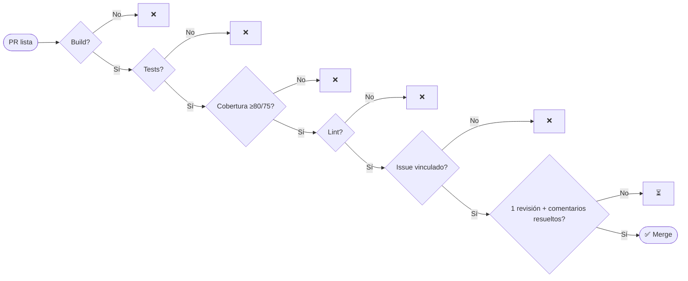

# pull-requests.md — Proceso de Pull Requests (parking)

> **Fuente de verdad** del proceso de PR del proyecto **parking** (ALEATICA).
> Alineado con `CLAUDE.md` (Phase 5), `docs/TESTING-STRATEGY.md` (umbrales) y `docs/SONAR-STANDARDS.md` (calidad).
> El **orquestador** (sesión Claude) crea ramas y PRs con el usuario **`lcasadov`**; la **revisión y el merge** los hace **`lcasadov`** (proyecto en solitario). La puerta humana es la **revisión + squash-merge manual** de `lcasadov` (1 revisión), no una "approval" formal de un tercero — GitHub no permite auto-aprobar (ver §5).
> Variables (`GITHUB_ORG`, `GITHUB_REPO`, `BASE_BRANCH`, `REPO_ROOT`) en `docs/PROJECT.md` → Anexo A.

---

## 1. Estrategia de branching

### Ramas permanentes
| Rama | Propósito | Protegida | Merge desde |
|---|---|---|---|
| `main` | Producción (PRO) | ✅ | `develop` (solo release tags) |
| `develop` | Integración continua — base de todas las features | ✅ | PRs de feature/fix/chore/test |

> ⚠️ Nunca crear ramas desde `main`. Solo el orquestador crea ramas; los agentes trabajan sobre la rama asignada.

### Ramas de trabajo (corta vida)
```
feat/<area>/<issue>-<slug>     nueva funcionalidad
fix/<area>/<issue>-<slug>      corrección de bug
chore/<area>/<issue>-<slug>    config / dependencias
test/<area>/<issue>-<slug>     solo tests
feat/fullstack/<issue>-<slug>  backend + frontend en la misma rama
```
**Áreas válidas:** `backend` · `frontend` · `devops` · `security` · `tester`. El `<issue>` es el número del Issue de GitHub.

**Ejemplos (parking):**
```
feat/backend/12-auth-local-login
feat/frontend/14-portal-empleado-mi-semana
feat/fullstack/21-solicitud-unificada
fix/backend/33-disponibilidad-409-concurrencia
chore/devops/05-github-actions-ci-base
test/tester/40-rbac-matrix
```

---

## 2. Convención de commits (Conventional Commits)
```
<tipo>(<area>): <descripción imperativa en minúsculas> (#<issue>)
```
| Tipo | Uso |
|---|---|
| `feat` | nueva funcionalidad |
| `fix` | corrección de bug |
| `refactor` | cambio sin alterar comportamiento |
| `test` | tests |
| `docs` | documentación / specs |
| `chore` | configuración, dependencias |

Reglas: imperativo y minúsculas, sin punto final, área obligatoria, `BREAKING CHANGE:` en el pie si aplica.

**Ejemplos:**
```
feat(backend): implementar POST /requests con validación de ventana 14d (#15)
fix(backend): devolver 409 al aprobar plaza no disponible (#33)
feat(frontend): vista Mi Semana con liberación voluntaria (#14)
test(tester): cubrir máquina de estados de Request (#40)
docs(orchestrator): actualizar openapi.yaml con approval_note (#15)
```

Todo commit termina con la firma de co-autoría que exige `CLAUDE.md`.

---

## 3. Flujo de tarea a merge


### Responsabilidades
| Actor | Crea rama | Commits | Crea PR | Revisa | Aprueba | Mergea |
|---|---|---|---|---|---|---|
| Orchestrator (Claude, como `lcasadov`) | ✅ | metadatos | ✅ | checklist | ❌ | ❌ |
| Agentes (backend/frontend/tester/security/devops) | ❌ | ✅ | ❌ | ❌ | ❌ | ❌ |
| Reviewer (`lcasadov`) | ❌ | ❌ | ❌ | ✅ | ✅ | ✅ |

### Crear la PR (orquestador)
```bash
# Valores de docs/PROJECT.md (Anexo A)
ORG="$GITHUB_ORG"; REPO="$GITHUB_REPO"; BASE="$BASE_BRANCH"   # develop
BRANCH="feat/backend/15-requests"; ISSUE_ID="15"; REVIEWER="${REVIEWER:-lcasadov}"

git ls-remote --exit-code --heads "https://github.com/$ORG/$REPO.git" "$BRANCH" \
  || { echo "Rama $BRANCH no existe en remoto"; exit 1; }

PR_URL=$(gh pr create --repo "$ORG/$REPO" --base "$BASE" --head "$BRANCH" \
  --title "feat(#$ISSUE_ID): <título del change>" \
  --body "<template §4 — debe contener 'Closes #$ISSUE_ID'>")

gh pr edit "$PR_URL" --repo "$ORG/$REPO" --add-reviewer "$REVIEWER"
gh issue edit "$ISSUE_ID" --repo "$ORG/$REPO" --add-label "in-review" --remove-label "in-progress"
gh issue comment "$ISSUE_ID" --repo "$ORG/$REPO" --body "PR creada: $PR_URL"
```

---

## 4. Template de PR (`--body`)

```markdown
## Resumen
<!-- Qué hace este cambio y por qué -->

## Issues vinculados
- User Story: Closes #<ID>
- Tasks: Closes #<ID1>, Closes #<ID2>

## Tipo de cambio
- [ ] ✨ Funcionalidad  - [ ] 🐛 Fix  - [ ] ♻️ Refactor  - [ ] 🧪 Tests  - [ ] 🔧 Config  - [ ] 📝 Docs

## Spec / Docs
- Change OpenSpec: `openspec/changes/<slug>/`
- API: `docs/openapi.yaml`

## Testing
- [ ] Unit (backend `mvn verify`, frontend `npm test`)
- [ ] Cobertura ≥ 80% líneas / ≥ 75% ramas (JaCoCo / Vitest)
- [ ] E2E Playwright (si aplica)
- [ ] Sin Issues `type:bug` abiertos de esta feature

## Notas para el reviewer
<!-- decisiones de diseño, trade-offs -->
```

---

## 5. Review y branch protection (`develop`)

| Policy | Valor | Motivo |
|---|---|---|
| Revisión requerida | **1 revisión manual** de `lcasadov` | `lcasadov` es autor y revisor; GitHub no permite auto-aprobar formalmente, así que la puerta humana es la **revisión + squash-merge manual** de `lcasadov`, equivalente a 1 aprobación. |
| Issue vinculado (`Closes #<ID>`) | requerido | trazabilidad con Projects |
| Conversaciones resueltas | requerido | sin comentarios pendientes |
| Estrategia de merge | **squash only** | historial limpio |
| Status checks | **GitHub Actions CI** (`ci.yml`) | CI debe pasar (la verdadera puerta bloqueante) |
| Borrado de rama tras merge | sí | higiene |

> Cuando se amplíe el equipo, formalizar la "1 revisión" como **aprobación requerida de un tercero** distinto del autor en la *branch protection*.

**Protocolo de `lcasadov`:** verificar CI verde → revisar diff (foco en lógica, seguridad, RBAC) → ejecutar local si afecta a flujos críticos (auth/SSO, disponibilidad) → **squash merge**.

---

## 6. Criterios de merge



**Criterios bloqueantes hoy (verificados por `ci.yml`):**

| # | Criterio | Tipo | Umbral |
|---|---|---|---|
| 1 | Build sin errores (backend `mvn clean verify` · frontend `npm run build`) | Auto (CI) | 100% |
| 2 | Tests unitarios (JUnit / Vitest) | Auto (CI) | 100% passing |
| 3 | Cobertura | Auto (JaCoCo/Vitest) | ≥80% líneas · ≥75% ramas · 100% flujos críticos |
| 4 | Lint frontend (ESLint) | Auto (CI) | 0 errores |
| 5 | Issue vinculado | Manual (convención `Closes #<ID>`) | requerido |
| 6 | 1 revisión + comentarios resueltos | Manual (`lcasadov`) | revisado |
| 7 | Security sign-off (si hay cambios de acceso/datos) | Manual (`security-auditor`) | OK |

**Criterios aspiracionales (NO implementados aún en CI — no bloquean el merge):**

| Criterio | Estado | Nota |
|---|---|---|
| SonarCloud Quality Gate | ⏳ Pendiente | `ci.yml` ejecuta `sonar:sonar` de forma condicional (solo si existe `SONAR_TOKEN`) y **sin** `-Dsonar.qualitygate.wait=true`, por lo que **no bloquea** el build. |
| OWASP Dependency-Check / `npm audit` | ⏳ Pendiente | No hay ningún step en `ci.yml` que analice CVEs de dependencias. |
| E2E (Playwright) | ⏳ Pendiente | La suite existe pero corre **en local bajo demanda**, no en CI (ver §7 y `frontend/e2e/README.md`). |

**Excepción:** cobertura < umbral en la primera PR de un módulo nuevo → requiere aprobación explícita del reviewer con justificación.

---

## 7. CI con GitHub Actions (stack parking)

El pipeline real es **un único workflow**: `.github/workflows/ci.yml`. No existen `backend-ci.yml` ni `frontend-ci.yml`. Se dispara en `push` y `pull_request` sobre `main` y `develop` (sin filtros `paths`: ambos jobs corren en cada evento) y define **dos jobs paralelos** — `backend` y `frontend`.

### Job `backend` — build, test, coverage, sonar
```yaml
runs-on: ubuntu-latest
defaults:
  run:
    working-directory: backend
steps:
  - name: Checkout                       # fetch-depth: 0 (Sonar necesita el historial), persist-credentials: false
    uses: actions/checkout@v4
  - name: Set up JDK 21                  # temurin, cache: maven
    uses: actions/setup-java@v4
  - name: Cache SonarCloud packages      # ~/.sonar/cache
    uses: actions/cache@v4
  - name: Build, test and coverage       # Testcontainers levanta SQL Server 2022 vía el socket Docker del runner
    run: mvn -B clean verify
  - name: SonarCloud analysis            # SOLO si env.SONAR_TOKEN != '' — condicional, no bloqueante
    if: ${{ env.SONAR_TOKEN != '' }}
    run: >
      mvn -B sonar:sonar
      -Dsonar.host.url=https://sonarcloud.io
      -Dsonar.projectKey=lcasadov_parking
      -Dsonar.organization=lcasadov
  - name: Upload JaCoCo report           # if: always() → artifact backend/target/site/jacoco/
    uses: actions/upload-artifact@v4
```

> **SQL Server**: no se usa `services:`; SQL Server 2022 lo levanta **Testcontainers** durante `mvn clean verify` usando el socket Docker del runner Ubuntu.
> **SonarCloud**: el step es condicional a que exista `SONAR_TOKEN` y corre `sonar:sonar` **sin** `-Dsonar.qualitygate.wait=true`. Es decir, **publica** el análisis pero **no bloquea** el build por el Quality Gate (ver §6, criterios aspiracionales).

### Job `frontend` — lint, build, test, coverage
```yaml
runs-on: ubuntu-latest
defaults:
  run:
    working-directory: frontend
steps:
  - name: Checkout                       # persist-credentials: false
    uses: actions/checkout@v4
  - name: Set up Node 22                 # node-version: '22', cache: npm, cache-dependency-path: frontend/package-lock.json
    uses: actions/setup-node@v4
  - name: Install dependencies
    run: npm ci
  - name: Lint
    run: npm run lint
  - name: Build
    run: npm run build
  - name: Test with coverage
    run: npm run test:coverage
  - name: Upload coverage report         # if: always() → artifact frontend/coverage/
    uses: actions/upload-artifact@v4
```

> **Node 22** (no 20): coherente con `frontend/package.json` (`engines.node >= 22`).

### Resumen de gates
| Gate | En `ci.yml` | Estado | Si falla |
|---|---|---|---|
| Build backend (`mvn clean verify`) | ✅ job `backend` | bloqueante | falla el check → bloquea PR |
| Tests backend + cobertura JaCoCo | ✅ job `backend` (dentro de `verify`) | bloqueante | bloquea PR |
| Lint frontend (`npm run lint`) | ✅ job `frontend` | bloqueante | bloquea PR |
| Build frontend (`npm run build`) | ✅ job `frontend` | bloqueante | bloquea PR |
| Tests frontend + cobertura (`npm run test:coverage`) | ✅ job `frontend` | bloqueante | bloquea PR |
| SonarCloud Quality Gate | ⚠️ análisis condicional a `SONAR_TOKEN`, sin `qualitygate.wait` | **no bloqueante** | no bloquea (pendiente) |
| OWASP Dependency-Check / `npm audit` | ❌ no existe | **pendiente** | — |
| E2E Playwright | ❌ no en CI (ejecución local bajo demanda) | **pendiente** | — |

> **E2E**: la suite Playwright (`frontend/e2e/`) valida login, solicitud/aprobación y plano móvil contra el **stack real** (SQL Server + backend `des`). No está cableada en CI porque los runners no garantizan ese stack completo; se ejecuta **en local bajo demanda** (ver `frontend/e2e/README.md`).
>
> **Pendientes de CI** (aspiracional, aún no implementado): bloqueo por Sonar Quality Gate (`-Dsonar.qualitygate.wait=true`), análisis de CVEs de dependencias (OWASP Dependency-Check / `npm audit`), y job E2E en pipeline.
>
> CI/CD migrará de GitHub Actions a Azure Pipelines al cerrar el arranque (`PROJECT.md`). SonarCloud se mantiene en ambos.

---

## Referencias
| Documento | Contenido |
|---|---|
| `CLAUDE.md` | Flujo del orquestador (Phase 5), identidad `lcasadov`, branching |
| `docs/PROJECT.md` (Anexo A) | Variables: `GITHUB_*`, `BASE_BRANCH`, `REPO_ROOT`, dirs, stack |
| `docs/TESTING-STRATEGY.md` | Umbrales de cobertura y tipos de test |
| `docs/SONAR-STANDARDS.md` | Reglas de calidad / Quality Gate |
| `docs/security-design.md` | RBAC y checklist de seguridad de PR |
| `docs/openapi.yaml` | Contrato API (sincronizado con el código) |
