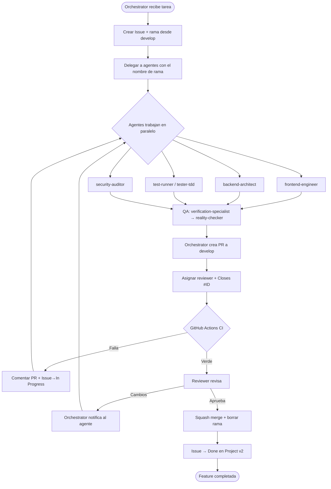
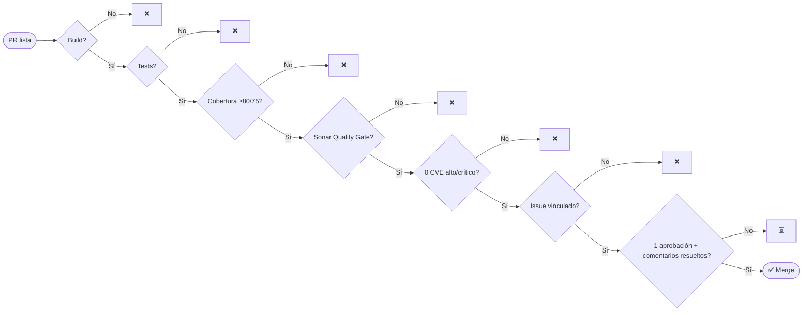

# pull-requests.md — Proceso de Pull Requests (parking)

> **Fuente de verdad** del proceso de PR del proyecto **parking** (ALEATICA).
> Alineado con `CLAUDE.md` (Phase 5), `docs/TESTING-STRATEGY.md` (umbrales) y `docs/SONAR-STANDARDS.md` (calidad).
> El **orquestador** (sesión Claude) crea ramas y PRs con el usuario **`lcasadov`**; la **revisión y el merge** los hace **`lcasadov`** (proyecto en solitario). Al coincidir autor y revisor, la *branch protection* no debe exigir aprobación de un tercero (ver §5).
> Variables (`GITHUB_ORG`, `GITHUB_REPO`, `BASE_BRANCH`, `REPO_ROOT`) en `docs/PROJECT.md` → Anexo A.

---

## 1. Estrategia de branching

### Ramas permanentes
| Rama | Propósito | Protegida | Merge desde |
|---|---|---|---|
| `main` | Producción (PRO) | ✅ | `develop` (solo release tags) |
| `develop` | Integración continua — base de todas las features | ✅ | PRs de feature/fix/chore/test |

> ⚠️ Nunca crear ramas desde `main`. Solo el orquestador crea ramas; los agentes trabajan sobre la rama asignada.

### Ramas de trabajo (corta vida)
```
feat/<area>/<issue>-<slug>     nueva funcionalidad
fix/<area>/<issue>-<slug>      corrección de bug
chore/<area>/<issue>-<slug>    config / dependencias
test/<area>/<issue>-<slug>     solo tests
feat/fullstack/<issue>-<slug>  backend + frontend en la misma rama
```
**Áreas válidas:** `backend` · `frontend` · `devops` · `security` · `tester`. El `<issue>` es el número del Issue de GitHub.

**Ejemplos (parking):**
```
feat/backend/12-auth-local-login
feat/frontend/14-portal-empleado-mi-semana
feat/fullstack/21-solicitud-unificada
fix/backend/33-disponibilidad-409-concurrencia
chore/devops/05-github-actions-ci-base
test/tester/40-rbac-matrix
```

---

## 2. Convención de commits (Conventional Commits)
```
<tipo>(<area>): <descripción imperativa en minúsculas> (#<issue>)
```
| Tipo | Uso |
|---|---|
| `feat` | nueva funcionalidad |
| `fix` | corrección de bug |
| `refactor` | cambio sin alterar comportamiento |
| `test` | tests |
| `docs` | documentación / specs |
| `chore` | configuración, dependencias |

Reglas: imperativo y minúsculas, sin punto final, área obligatoria, `BREAKING CHANGE:` en el pie si aplica.

**Ejemplos:**
```
feat(backend): implementar POST /requests con validación de ventana 14d (#15)
fix(backend): devolver 409 al aprobar plaza no disponible (#33)
feat(frontend): vista Mi Semana con liberación voluntaria (#14)
test(tester): cubrir máquina de estados de Request (#40)
docs(orchestrator): actualizar openapi.yaml con approval_note (#15)
```

Todo commit termina con la firma de co-autoría que exige `CLAUDE.md`.

---

## 3. Flujo de tarea a merge



### Responsabilidades
| Actor | Crea rama | Commits | Crea PR | Revisa | Aprueba | Mergea |
|---|---|---|---|---|---|---|
| Orchestrator (Claude, como `lcasadov`) | ✅ | metadatos | ✅ | checklist | ❌ | ❌ |
| Agentes (backend/frontend/tester/security/devops) | ❌ | ✅ | ❌ | ❌ | ❌ | ❌ |
| Reviewer (`lcasadov`) | ❌ | ❌ | ❌ | ✅ | ✅ | ✅ |

### Crear la PR (orquestador)
```bash
# Valores de docs/PROJECT.md (Anexo A)
ORG="$GITHUB_ORG"; REPO="$GITHUB_REPO"; BASE="$BASE_BRANCH"   # develop
BRANCH="feat/backend/15-requests"; ISSUE_ID="15"; REVIEWER="${REVIEWER:-lcasadov}"

git ls-remote --exit-code --heads "https://github.com/$ORG/$REPO.git" "$BRANCH" \
  || { echo "Rama $BRANCH no existe en remoto"; exit 1; }

PR_URL=$(gh pr create --repo "$ORG/$REPO" --base "$BASE" --head "$BRANCH" \
  --title "feat(#$ISSUE_ID): <título del change>" \
  --body "<template §4 — debe contener 'Closes #$ISSUE_ID'>")

gh pr edit "$PR_URL" --repo "$ORG/$REPO" --add-reviewer "$REVIEWER"
gh issue edit "$ISSUE_ID" --repo "$ORG/$REPO" --add-label "in-review" --remove-label "in-progress"
gh issue comment "$ISSUE_ID" --repo "$ORG/$REPO" --body "PR creada: $PR_URL"
```

---

## 4. Template de PR (`--body`)

```markdown
## Resumen
<!-- Qué hace este cambio y por qué -->

## Issues vinculados
- User Story: Closes #<ID>
- Tasks: Closes #<ID1>, Closes #<ID2>

## Tipo de cambio
- [ ] ✨ Funcionalidad  - [ ] 🐛 Fix  - [ ] ♻️ Refactor  - [ ] 🧪 Tests  - [ ] 🔧 Config  - [ ] 📝 Docs

## Spec / Docs
- Change OpenSpec: `openspec/changes/<slug>/`
- API: `docs/openapi.yaml`

## Testing
- [ ] Unit (backend `mvn verify`, frontend `npm test`)
- [ ] Cobertura ≥ 80% líneas / ≥ 75% ramas (JaCoCo / Vitest)
- [ ] E2E Playwright (si aplica)
- [ ] Sin Issues `type:bug` abiertos de esta feature

## Notas para el reviewer
<!-- decisiones de diseño, trade-offs -->
```

---

## 5. Review y branch protection (`develop`)

| Policy | Valor | Motivo |
|---|---|---|
| Aprobaciones requeridas | **0** (proyecto en solitario) | `lcasadov` es autor y revisor; GitHub no permite auto-aprobar, así que la puerta humana es la **revisión + merge manual** de `lcasadov`, no una "approval". |
| Issue vinculado (`Closes #<ID>`) | requerido | trazabilidad con Projects |
| Conversaciones resueltas | requerido | sin comentarios pendientes |
| Estrategia de merge | **squash only** | historial limpio |
| Status checks | **GitHub Actions CI** | CI debe pasar (la verdadera puerta bloqueante) |
| Borrado de rama tras merge | sí | higiene |

> Cuando se amplíe el equipo, subir "Aprobaciones requeridas" a **1** (de un tercero distinto del autor).

**Protocolo de `lcasadov`:** verificar CI verde → revisar diff (foco en lógica, seguridad, RBAC) → ejecutar local si afecta a flujos críticos (auth/SSO, disponibilidad) → **squash merge**.

---

## 6. Criterios de merge



| # | Criterio | Tipo | Umbral |
|---|---|---|---|
| 1 | Build sin errores | Auto (CI) | 100% |
| 2 | Tests unitarios | Auto (CI) | 100% passing |
| 3 | Cobertura | Auto (JaCoCo/Vitest) | ≥80% líneas · ≥75% ramas · 100% flujos críticos |
| 4 | SonarCloud Quality Gate | Auto (CI) | passed |
| 5 | OWASP Dependency-Check / `npm audit` | Auto (CI) | 0 CVE high/critical |
| 6 | Lint | Auto (Checkstyle/ESLint) | 0 errores |
| 7 | Issue vinculado | Auto (branch protection) | requerido |
| 8 | 1 aprobación | Manual (reviewer) | aprobado |
| 9 | Security sign-off (si hay cambios de acceso/datos) | Manual (`security-auditor`) | OK |

**Excepción:** cobertura < umbral en la primera PR de un módulo nuevo → requiere aprobación explícita del reviewer con justificación.

---

## 7. CI con GitHub Actions (stack parking)

### Backend — `.github/workflows/backend-ci.yml`
```yaml
name: Backend CI
on:
  pull_request:
    branches: [develop]
    paths: ['backend/**']
jobs:
  build_and_test:
    runs-on: ubuntu-latest
    services:
      sqlserver:
        image: mcr.microsoft.com/mssql/server:2022-latest
        env: { ACCEPT_EULA: 'Y', MSSQL_SA_PASSWORD: 'Your_strong_Passw0rd' }
        ports: ['1433:1433']
    steps:
      - uses: actions/checkout@v4
      - uses: actions/setup-java@v4
        with: { distribution: temurin, java-version: '21', cache: maven }
      - name: Build + Test + JaCoCo
        run: mvn -f backend/pom.xml -P ci clean verify   # umbral 80% líneas / 75% ramas
  quality:
    needs: build_and_test
    runs-on: ubuntu-latest
    steps:
      - uses: actions/checkout@v4
      - name: SonarCloud
        run: mvn -f backend/pom.xml sonar:sonar
        env: { SONAR_TOKEN: '${{ secrets.SONAR_TOKEN }}' }
      - name: OWASP Dependency-Check
        uses: dependency-check/Dependency-Check_Action@main
        with: { project: parking-api, path: backend, format: HTML, args: '--failOnCVSS 7' }
```

### Frontend — `.github/workflows/frontend-ci.yml`
```yaml
name: Frontend CI
on:
  pull_request:
    branches: [develop]
    paths: ['frontend/**']
jobs:
  build_and_test:
    runs-on: ubuntu-latest
    steps:
      - uses: actions/checkout@v4
      - uses: actions/setup-node@v4
        with: { node-version: '20', cache: npm, cache-dependency-path: frontend/package-lock.json }
      - run: npm ci
        working-directory: frontend
      - run: npm run lint
        working-directory: frontend
      - run: npm run test:coverage      # Vitest, umbral 80/75
        working-directory: frontend
      - run: npm run build
        working-directory: frontend
  e2e:
    needs: build_and_test
    runs-on: ubuntu-latest
    steps:
      - uses: actions/checkout@v4
      - run: npm ci && npx playwright install --with-deps
        working-directory: frontend
      - run: npm run e2e                 # Playwright
        working-directory: frontend
  quality:
    needs: build_and_test
    runs-on: ubuntu-latest
    steps:
      - uses: actions/checkout@v4
      - run: npm ci
        working-directory: frontend
      - run: npm audit --audit-level=high
        working-directory: frontend
```

### Resumen de gates
| Gate | Workflow | Umbral | Si falla |
|---|---|---|---|
| Build | CI | 0 errores | bloquea PR |
| Tests unitarios | CI | 100% | bloquea PR |
| Cobertura líneas/ramas | CI | ≥80% / ≥75% | bloquea PR |
| SonarCloud Quality Gate | CI | passed | bloquea PR |
| OWASP CVSS / npm audit | CI | < 7.0 / 0 high | bloquea PR |
| E2E Playwright | CI | 100% | bloquea release |

> CI/CD migrará de GitHub Actions a Azure Pipelines al cerrar el arranque (`PROJECT.md`). SonarCloud se mantiene en ambos.

---

## Referencias
| Documento | Contenido |
|---|---|
| `CLAUDE.md` | Flujo del orquestador (Phase 5), identidad `lcasadov`, branching |
| `docs/PROJECT.md` (Anexo A) | Variables: `GITHUB_*`, `BASE_BRANCH`, `REPO_ROOT`, dirs, stack |
| `docs/TESTING-STRATEGY.md` | Umbrales de cobertura y tipos de test |
| `docs/SONAR-STANDARDS.md` | Reglas de calidad / Quality Gate |
| `docs/security-design.md` | RBAC y checklist de seguridad de PR |
| `docs/openapi.yaml` | Contrato API (sincronizado con el código) |
